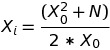
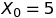
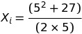
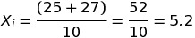
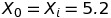
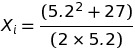
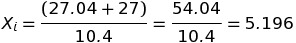
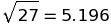

### Method Newton Raphson Squater
>It is a mathematic method to calculate the squarter root of a number:  
  

For example the number **27**:  
The close number for **27** is **25**, because **5x5=25** and **6x6=36**.  

So that   
>
>  
Now it is set to  for the next iteration:  
>
>  
The result for this the   

**Note:** Reference for [image formulas](http://www.sciweavers.org/free-online-latex-equation-editor)
